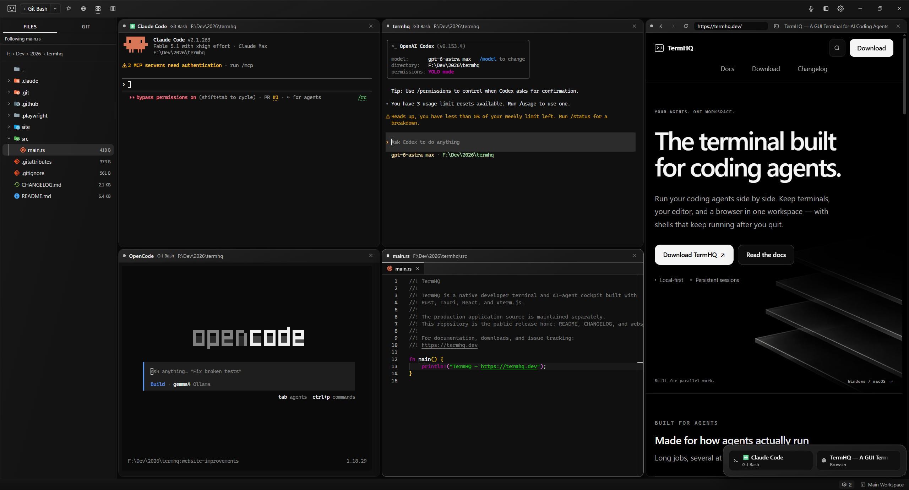
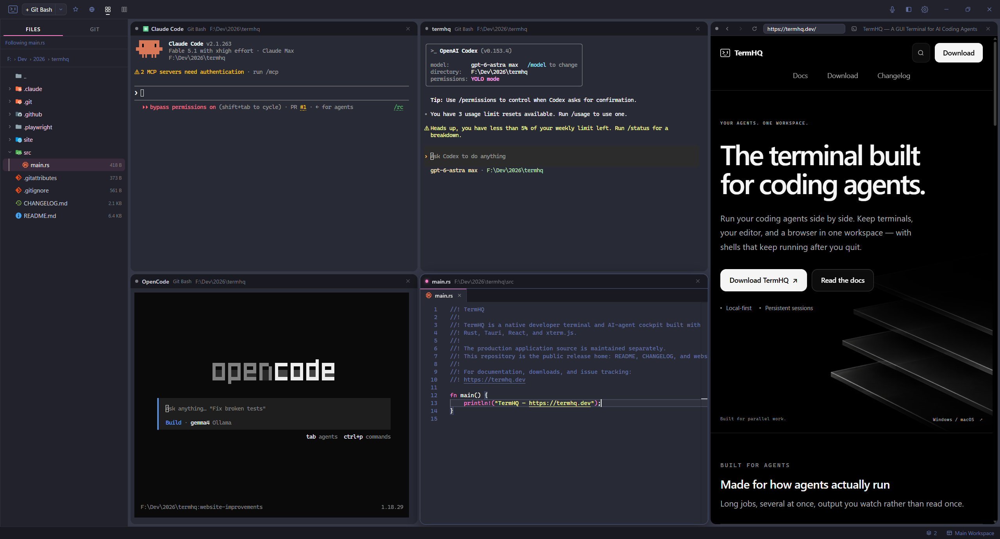
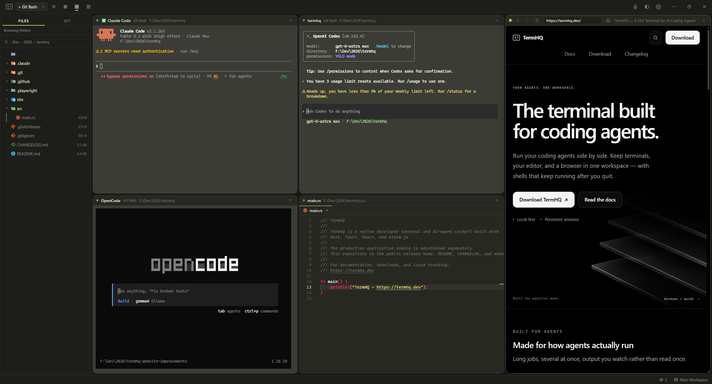

  

<strong>The terminal built for coding agents.</strong>

  
  
  
  

---

Run your coding agents side by side. Keep terminals, an editor, and a live
browser in one workspace, with shells that keep running after you quit.

[Download TermHQ](https://termhq.dev/download/) ·
[Get started](https://termhq.dev/docs/getting-started/) ·
[Documentation](https://termhq.dev/docs/)

Available for **Windows 10/11** and **macOS (Apple silicon)**. **Linux support is
pending.** Builds are not yet code-signed; read the
[installation guide](https://termhq.dev/docs/installation/) for the Windows
SmartScreen and macOS Gatekeeper warnings before your first launch.

## See TermHQ

Coding agents, an editor, and a live browser — together in one workspace.

*Shown in TermHQ’s own Default theme. All screenshots were captured on Windows.*

More theme examples: Dracula and Monokai

Dracula and Monokai are examples of VS Code themes installed through TermHQ’s
integrated marketplace, not the full set of available themes. You can also
choose other built-in themes or create your own.
[Explore theming](https://termhq.dev/docs/theming/).

### Dracula · Marketplace

### Monokai · Marketplace

## What TermHQ is

TermHQ is a local-first terminal workspace for parallel work. Give each agent
its own pane, keep your preview beside the code, and review changes without
leaving the project. Named workspaces keep your projects organized. When a busy
pane goes quiet, a waiting list in the status bar helps you find it again;
native notifications get your attention when TermHQ is in the background.

Use the shells and coding agents you already have installed. TermHQ does not
bundle agent CLIs or replace their accounts and subscriptions. The built-in
editor handles edits and reviews alongside your terminals; you can keep using
your preferred IDE too.

## Capabilities

- **Tiling panes** — arrange terminals, editors, and browsers in a grid or
  columns. Resize by dragging boundaries, move panes with the keyboard, focus
  one fullscreen, or stash a terminal while it keeps running.
- **Persistent sessions** — close TermHQ and reconnect to running shells with
  recent output when you return. Each workspace remembers its layout and
  working directories. No separate terminal multiplexer is needed.
- **Agent launchers** — start installed tools such as Claude Code, Codex,
  OpenCode, or Antigravity in a terminal, folder, or worktree. Customize agent
  commands and flags in Settings.
- **Browser panes** — keep a live site or local preview beside your terminals,
  with an address bar and developer tools. See the
  [browser guide](https://termhq.dev/docs/browser-panes/) for platform differences.
- **Editor panes** — edit files in tabs, preview Markdown, and recover unsaved
  text after a crash. Save prompts and external-change warnings help protect
  your work.
- **Language assistance** — get completion, diagnostics, navigation, and
  formatting from language servers you install and configure for your projects.
- **Source control** — review diffs, stage files or individual hunks, commit,
  browse history, manage branches and stashes, and sync with your remote.
  Resolve merge conflicts directly in the editor, or copy a briefing for an agent.
- **Worktrees** — keep parallel branches in separate working folders. Track
  checkouts across chosen repositories and open a terminal or agent in the
  right one.
- **Local voice dictation** — dictate into a terminal with transcription on
  your machine. Download or import a speech model in **Settings → Voice** when
  you want to use it; dictation is optional.
- **Themes and shortcuts** — choose a built-in theme, install VS Code color
  and icon themes from Open VSX, and rebind shortcuts to fit your workflow.
- **Recovery and updates** — undo an accidental terminal close during the
  brief undo window. Check for app updates in Settings and choose when to
  install them.

By default, shells keep running after you close TermHQ. **Restarting your
computer or installing an app update stops running commands and agents**;
your layout and working directories return with fresh shells. See
[persistent sessions](https://termhq.dev/docs/persistent-sessions/) for the
settings and recovery details.

## Get started

1. [Download and install TermHQ](https://termhq.dev/download/) for your platform.
2. Open a terminal in your project and run your installed coding agent, or use
   the agent launcher in the pane header.
3. Add terminals, an editor, or a browser pane alongside it. Organize each
   project in a named workspace; TermHQ remembers its layout for your return.

| Action | Windows | macOS |
|---|---|---|
| New terminal | `Ctrl+J` | `⌘+J` |
| New browser pane | `Ctrl+Shift+B` | `⌘+Shift+B` |
| New editor pane | `Ctrl+Shift+E` | `⌘+Shift+E` |
| Command palette | `Ctrl+Shift+P` | `⌘+Shift+P` |

If a TermHQ shortcut overlaps with Vim or another terminal program, rebind or
clear it in **Settings → Shortcuts**, or turn on **Ultra focus** to pass
shortcuts through. See the
[keyboard shortcut guide](https://termhq.dev/docs/keyboard-shortcuts/#when-a-terminal-program-wants-the-same-key)
for the toggle and exceptions.

## Links

| | |
|---|---|
| Website | [termhq.dev](https://termhq.dev) |
| Documentation | [termhq.dev/docs](https://termhq.dev/docs) |
| Changelog | [CHANGELOG.md](CHANGELOG.md) |
| Downloads | [Releases](../../releases) |

## Reporting a problem

Bug reports and feature requests belong in this repository's
[Issues](../../issues). Please include your OS and version, the TermHQ
version, and what you expected to happen.

## Privacy

TermHQ runs locally, and voice transcription happens on your machine. Speech
models are downloaded only when you request them; the app works without one.
Theme and icon downloads from [Open VSX](https://open-vsx.org/) are also optional.

Local-first does not mean offline-only: browser panes connect to the sites you
open, and coding agents use their own services and privacy policies. Automatic
update checks can be turned off in **Settings → General → Updates**.

## About this repository

This is TermHQ's user-facing home: the website, the documentation, the
changelog, and the releases. The application source is maintained privately and
is not published here.

## License

Licensing is not final. A license file will be added to this repository; until
then, the releases are free to download and use as they are.
